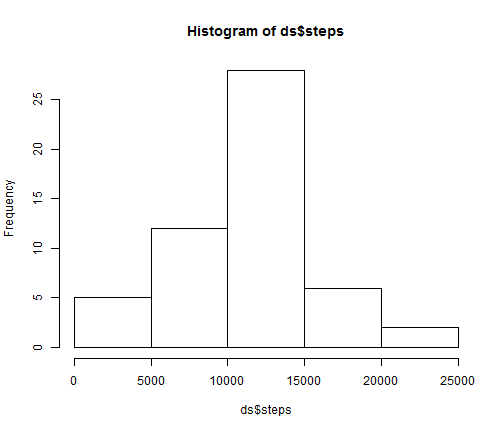
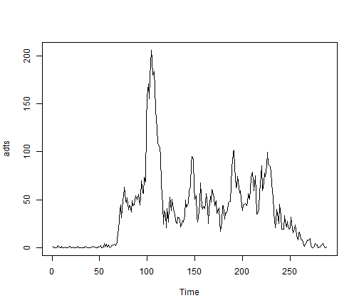
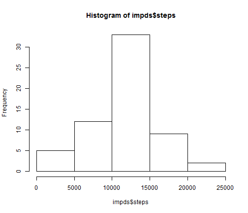
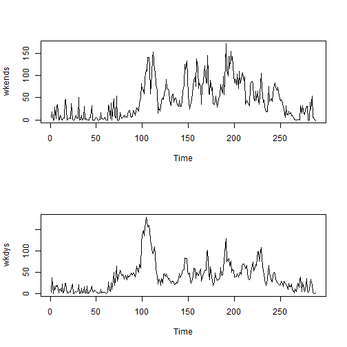

Activity Monitoring Peer Assessment 1
========================================================

**Load Packages**

```r
library(dplyr)
library(stringr)
library(reshape2)
library(mice)
library(lattice)
```
**Read Data**


```r
activity<-read.csv("activity.csv", header=T)
```

**Clean Data**

```r
dly_steps<-select(activity, date, steps)
daily<-melt(dly_steps)
ds<-dcast(daily, date~., fun.aggregate=sum)
colnames(ds)[2]<-"steps"
```
**Mean Total Steps Taken Per Day?**

```r
library(dplyr)
library(stringr)
library(reshape2)
activity<-read.csv("activity.csv", header=T)
dly_steps<-select(activity, date, steps)
daily<-melt(dly_steps)
ds<-dcast(daily, date~., fun.aggregate=sum)
colnames(ds)[2]<-"steps"
hist(ds$steps)
```

 

The mean was 
10766

The median was
10765


**What is the average daily activity pattern?**


```r
library(dplyr)
library(stringr)
library(reshape2)
activity<-read.csv("activity.csv", header=T)
adap<-select(activity, interval, steps)
adapmelt<-melt(adap, id.vars="interval")
adapcast<-dcast(adapmelt, interval~., fun.aggregate=mean, na.rm=T)
colnames(adapcast)[2]<-"steps"
adts<-as.ts(adapcast$steps, na.rm=T, frequency=1)
plot(adts)
```

 
Which time interval has the greatest average number of steps? The
835th

**Imputing Missing Values**
What are the number of NAs?

Number of NAs can be found by 

```r
activity<-read.csv("activity.csv", header=T)
sum(is.na(activity))
```

```
## [1] 2304
```

A breakdown of course occurs in 

```r
summary(activity)
```

```
##      steps               date          interval   
##  Min.   :  0.0   2012-10-01:  288   Min.   :   0  
##  1st Qu.:  0.0   2012-10-02:  288   1st Qu.: 589  
##  Median :  0.0   2012-10-03:  288   Median :1178  
##  Mean   : 37.4   2012-10-04:  288   Mean   :1178  
##  3rd Qu.: 12.0   2012-10-05:  288   3rd Qu.:1766  
##  Max.   :806.0   2012-10-06:  288   Max.   :2355  
##  NA's   :2304    (Other)   :15840
```
We will use the MICE package to impute


```r
library(mice)
imp<-mice(activity)
```

```
## 
##  iter imp variable
##   1   1  steps
##   1   2  steps
##   1   3  steps
##   1   4  steps
##   1   5  steps
##   2   1  steps
##   2   2  steps
##   2   3  steps
##   2   4  steps
##   2   5  steps
##   3   1  steps
##   3   2  steps
##   3   3  steps
##   3   4  steps
##   3   5  steps
##   4   1  steps
##   4   2  steps
##   4   3  steps
##   4   4  steps
##   4   5  steps
##   5   1  steps
##   5   2  steps
##   5   3  steps
##   5   4  steps
##   5   5  steps
```

```r
impactivity<-complete(imp)

impdly_steps<-select(impactivity, date, steps)

impdaily<-melt(impdly_steps)
impds<-dcast(impdaily, date~., fun.aggregate=sum)
colnames(impds)[2]<-"steps"
```

Now we can graph the output and also look at the mean and median

```r
hist(impds$steps)
```

 

The mean of the imputed steps is
11211

The median of the imputed steps is
11458

**Differences between Weekdays and Weekends?**
We will use the imputed dataset from now on.

```r
activity<-impactivity
activity$date<-as.Date(activity$date)
Weekends<-filter(activity, weekdays(activity$date)=="Saturday"|weekdays(activity$date)=="Sunday")
Weekdays<-filter(activity, weekdays(activity$date)!="Saturday"|weekdays(activity$date)!="Sunday")
Weekends<-select(Weekends, interval, steps)
wkd<-melt(Weekends, id.vars="interval")
wkends<-dcast(wkd, interval~., fun.aggregate=mean)
colnames(wkends)[2]<-"steps"
wkends<-as.ts(wkends$steps, frequency=1)

Weekdays<-select(Weekdays, interval, steps)
wky<-melt(Weekdays, id.vars="interval")
wkdys<-dcast(wky, interval~., fun.aggregate=mean)
colnames(wkdys)[2]<-"steps"
wkdys<-as.ts(wkdys$steps, frequency=1)


par(mfrow=c(2, 1))
plot(wkends)
plot(wkdys)
```

 
